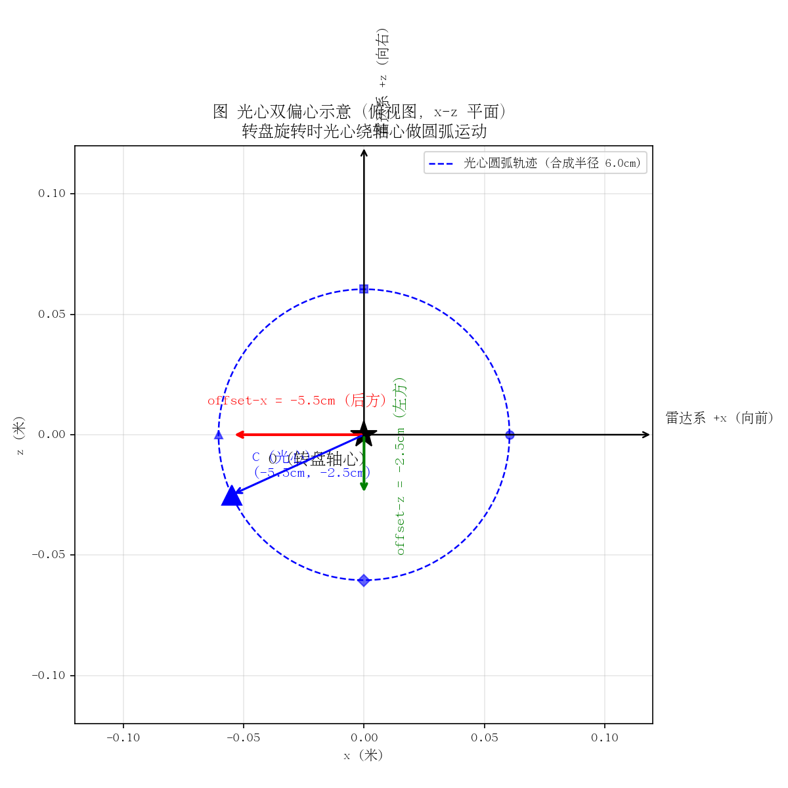

# drill_rod_scanner 使用指南

> 日期：2026-08-13
> 环境：conda `drill_rod_scanner`（Python 3.10）
> 全部命令在项目根目录 `/mnt/d/work/drill_rod_scanner` 下执行

## 0. 环境准备

**推荐环境：`ros_humble`**（ROS2 humble + 项目依赖 + RViz，一条龙扫描/发布/查看）：

```bash
# 创建（RoboStack 提供 ROS2，需已配置 robostack-staging + conda-forge 频道）
conda create -n ros_humble -c robostack-staging -c conda-forge ros-humble-desktop python=3.10 -y
conda activate ros_humble
pip install pyserial numpy open3d pyyaml

# 激活时自动配置 ROS2（RMW_IMPLEMENTATION=rmw_cyclonedds_cpp 等已写入激活钩子）
conda activate ros_humble
```

**备用环境：`drill_rod_scanner`**（仅扫描，无 ROS2）：

```bash
conda create -n drill_rod_scanner python=3.10 -y
conda activate drill_rod_scanner
pip install pyserial numpy open3d pyyaml pytest
pip install -e .          # 安装项目包（可编辑模式）
```

**硬件接线**：
- 舵机：USB 串口 `/dev/ttyUSB0`，波特率 115200
- 雷达：以太网口，本机网卡配 `192.168.198.1/24`，雷达默认 `192.168.198.2:2368`
- 上电后浏览器开 `http://192.168.198.2` 确认 `laser_enable=true`、`DataPort=2368`

---

## 1. 主程序：转盘扫描 + 点云拼接（servo_sweep_scan.py）

### 1.1 基本用法

```bash
python scripts/servo_sweep_scan.py
```

启动后自动：归位转盘 → 逐位置扫描 → Open3D 实时显示 3D 点云 → 保持窗口交互查看。

### 1.2 完整参数表

| 参数 | 默认 | 说明 |
|------|------|------|
| `--port` | /dev/ttyUSB0 | 舵机串口设备 |
| `--baud` | 115200 | 舵机波特率 |
| `--install-config` | "" | 雷达安装方式 YAML 配置（默认内置横装 side-mount，见 `configs/install_side_mount.yaml`） |
| `--start` | 500 | 舵机起始位置 P |
| `--end` | 1000 | 舵机结束位置 P（含） |
| `--step` | 10 | 每次位置增量 |
| `--interval` | 2.0 | 每位置停留秒数（等雷达采完一圈） |
| `--move-time` | 2000 | 舵机移动耗时 T（ms） |
| `--home-wait` | 3.0 | 归位后等待到位秒数 |
| `--servo-id` | 0 | 舵机 ID |
| `--axis` | z | 拼接旋转轴（z = 世界转盘轴） |
| `--lidar-port` | 2368 | 雷达 UDP 数据端口 |
| `--offset-y` | 0.0 | 光心偏心 y 校正（米，雷达系 y 方向） |
| `--offset-z` | 0.0 | 光心偏心 z 校正（米，雷达系 z 方向） |
| `--max-range` | 50.0 | 最大显示/拼接距离（米） |
| `--save-dir` | 自动时间戳 | 保存点云目录，默认 `output/scan_时间戳/`（每次独立），可用 `--save-dir` 指定 |
| `--continuous` | - | 连续转动模式（发一条命令连续转，全程记录帧后抽帧融合） |
| `--total-time` | 60.0 | 连续模式转盘总耗时（秒），仅 --continuous 生效 |
| `--publish-topic` | "" | 扫描完成后自动发布点云到该 ROS2 topic（如 /drill_scan_cloud），空=不发布 |
| `--publish-frame` | map | 发布点云的 frame_id |
| `--publish-rate` | 2.0 | 发布频率 Hz |
| `--grid` | -1 | 网格半宽（<0 自动= max-range，0 关闭） |
| `--grid-step` | 1.0 | 网格线间距（米） |
| `--dry-run` | - | 只打印舵机指令，不连硬件 |
| `--debug` | - | 打印每个 UDP 包诊断 |

> 角度说明：舵机位置 500-2500 固定映射 0-360°，角度由位置自动计算，无需手动指定。

### 1.3 命令案例

**① 最小验证（不连硬件）**：
```bash
python scripts/servo_sweep_scan.py --dry-run --start 500 --end 540 --step 20
```
预期输出：
```
[home] 转盘归位到起始位置 500: #000P0500T2000!
[home] 等待 3.0s 到位...
[dry-run] 仅验证舵机指令序列（含归位），不连接雷达/Open3D，退出
```

**② 步进模式扫描 + 自动发布（不连续，逐位置停稳采帧后融合）**：
```bash
conda activate ros_humble
python3 scripts/servo_sweep_scan.py \
  --start 500 --end 2500 --step 1 --interval 0.05 \
  --offset-y -0.055 --offset-z 0.025 \
  --max-range 20 \
  --publish-topic /drill_scan_cloud
```
逐位置发送舵机指令 → 停 `--interval` 秒采一圈 → 融合。`--step 1` + 快 interval
适合快速全量扫描；默认保存到 `output/scan_时间戳/`（`cloud.ply` + `cloud.npy`）。

**③ 带网格参考的快速扫描**：
```bash
python scripts/servo_sweep_scan.py \
  --start 500 --end 2500 --step 100 --interval 1.0 \
  --max-range 5 --grid 6 --grid-step 1
```

**④ 连续转动模式（转盘一条命令连续转完，全程记录帧后抽帧融合）**：
```bash
python scripts/servo_sweep_scan.py \
  --continuous --total-time 60 \
  --start 500 --end 2500 --step 50 \
  --offset-y -0.055 --offset-z 0.025 \
  --max-range 20
```
转盘 60 秒连续转完 360°，全程记录雷达每一帧到默认目录 `output/scan_时间戳/frames.npz`，
按抽帧间隔（max(位置步长, 雷达帧间隔)）抽帧融合成 3D 点云。

**连续模式帧数据说明**（`--save-dir` 目录下）：
- `frames.npz`：转动期间记录的**全部雷达帧**（`ts` 时间戳数组 + `frames` 帧点云 object 数组）
- `cloud.ply` / `cloud.npy`：按步长抽帧融合后的最终 3D 点云

**④' 连续模式 + 自动发布（扫描完成后自动发布到 ROS2 topic，RViz 直接查看）**：
```bash
conda activate ros_humble     # 需在 ros_humble 环境（含 ROS2 + 项目依赖）
python3 scripts/servo_sweep_scan.py \
  --continuous --total-time 10 \
  --start 500 --end 2500 --step 1 \
  --offset-y -0.055 --offset-z 0.025 \
  --max-range 20 \
  --publish-topic /drill_scan_cloud
```

### 1.3.1 实测安装参数（本机标定值）

> 记录自实机标定（2026-08-13），当前雷达安装的**偏心修正参数**：

| 参数 | 值 | 说明 |
|------|-----|------|
| `--offset-y` | **-0.055** | 光心沿雷达 y 方向偏心（左 5.5cm） |
| `--offset-z` | **0.025** | 光心沿雷达 z 方向偏心（前 2.5cm） |

**含义**：光心相对转盘轴心在两个方向都有偏移（y 方向 5.5cm、z 方向 2.5cm），
用这两个参数在坐标变换前把光心平移到转盘轴心。安装改变后需重新标定。



> 图：俯视图（雷达系 y-z 平面）。O 为转盘轴心，C 为光心（相对轴心偏移
> -5.5cm/+2.5cm），转盘旋转时光心沿蓝色虚线圆弧绕轴心运动。

扫描抽帧融合完成后自动发布点云，另开终端查看：
```bash
conda activate ros_humble
rviz2
# Fixed Frame=map → Add → PointCloud2 → /drill_scan_cloud
```

**⑤ 调试雷达数据**：
```bash
python scripts/servo_sweep_scan.py --debug \
  --start 500 --end 520 --step 10 --max-range 3
```
每包打印：`[debug] 包 1206B, 首块方位角 144.0, 解析 187 点`。

**⑥ 偏心标定**：本机实测双偏心 `--offset-y -0.055 --offset-z 0.025`
（光心偏 y 左方 5.5cm、z 前方 2.5cm），详见 §1.3.1 示意图：
```bash
python scripts/servo_sweep_scan.py --offset-y -0.055 --offset-z 0.025 ...
```

### 1.4 坐标系说明（重要）

- **雷达系**（横装）：x 向下、y 向左、z 向前；扫描弧在雷达 x-y 平面（0° 指 +x 下、90° 指 +y 左）。xyz 是雷达系坐标，横装不改变它。
- **世界系**：z 竖直（转盘轴）、x/y 水平（转盘平面）
- **坐标链**：极坐标 → 雷达系xyz → 安装配置变换（mount 棱镜相位 + to_world 安装姿态）→ 偏心校正 → 绕世界 z（转盘轴）旋转聚合
- **安装配置**：默认横装（`configs/install_side_mount.yaml`），换安装方式用 `--install-config` 指定 YAML，格式见 `scripts/install_config.py` 与下文 §1.5

### 1.5 安装方式配置（换雷达安装不用改代码）

安装方式由两个自由度描述，对应两个独立的变换：

| 变换 | 物理含义 | 配置项 |
|------|---------|--------|
| **mount** | 棱镜 0° 参考相位：LakiBeam 出厂 0° 参考与雷达 x 轴存在夹角，安装时绕雷达某轴旋转对齐 | `mount.axis` / `mount.angle_deg` |
| **to_world** | 安装姿态：雷达系三轴相对世界系（转盘系）的指向 | `to_world.x/y/z`（世界系各轴取自雷达系哪个轴，可带负号） |

**默认横装配置**（`configs/install_side_mount.yaml`）：
```yaml
name: side-mount
description: 横装：雷达 x 下、y 左、z 前（默认）
mount:
  axis: z
  angle_deg: 90.0        # 棱镜 0° 参考绕雷达 z 轴 90°
to_world:
  x: z                   # 世界 x = 雷达 z（前）
  y: y                   # 世界 y = 雷达 y（左）
  z: -x                  # 世界 z = -雷达 x（下→上）
turntable_axis: z        # 转盘旋转轴（世界系）
```

**换安装方式**：复制一份 YAML 修改后指定即可，例如把雷达正装（出厂姿态 x 前/y 左/z 上、棱镜 0° 相位）：
```yaml
# configs/install_upright.yaml
name: upright
mount:
  axis: z
  angle_deg: 0.0
to_world:
  x: x
  y: y
  z: z
turntable_axis: z
```
```bash
python scripts/servo_sweep_scan.py --install-config configs/install_upright.yaml ...
```

**换安装后的标定流程**：改完安装配置后，先用单帧可视化确认弧的方向
（0° 应指向水平、90° 指向竖直），再实测偏心 `--offset-y/--offset-z`。
若发现水平面倾斜（转盘轴不竖直），用软件调平（见 §1.6）。

### 1.6 软件调平（转盘轴不竖直时）

转盘轴不竖直会导致扫描出的水平面（地面/桌面）整体倾斜。用 `level_scan.py`
标定并自动写回配置文件，后续扫描自动校正：

```bash
# 方式 1（推荐）：对已保存的扫描点云离线标定
python scripts/level_scan.py \
  --cloud output/scan_时间戳/cloud.npy \
  --install-config configs/install_side_mount.yaml

# 方式 2：连接硬件实时采一圈地面后标定
python scripts/level_scan.py --scan \
  --install-config configs/install_side_mount.yaml \
  --start 500 --end 2500 --step 100
```

输出示例：
```
[fit] 水平面法向量 = (0.0000, -0.0533, 0.9986)
[fit] 水平面倾斜角 = 3.0578°
[write] 校正矩阵已写入 configs/install_side_mount.yaml
```

标定后重新运行 `servo_sweep_scan.py`（使用同一 config），水平面自动恢复水平
（经仿真验证：校正后偏离竖直 0.000000°）。

**注意**：拟合的是点云中最大的水平平面——确保扫描时地面/桌面可见且未被大面积遮挡。

---

## 2. 雷达单帧可视化（lakibeam_viewer.py）

调试雷达本身用——实时显示单圈 2D 点云。

```bash
python scripts/lakibeam_viewer.py                        # 默认 192.168.198.2:2368
python scripts/lakibeam_viewer.py --lidar-ip 192.168.198.2 --port 2368
python scripts/lakibeam_viewer.py --max-range 6 --height 0.5
python scripts/lakibeam_viewer.py --debug                # 打印每包诊断
```

| 参数 | 默认 | 说明 |
|------|------|------|
| `--lidar-ip` | 192.168.198.2 | 雷达 IP |
| `--port` | 2368 | 雷达数据端口 |
| `--host-ip` | 0.0.0.0 | 绑定本机 IP |
| `--height` | 0.0 | 扫描平面高度（米） |
| `--min-rssi` | 0 | 回波强度下限过滤 |
| `--max-range` | 50.0 | 最大显示距离 |
| `--fps` | 20 | 帧信息打印频率 |
| `--debug` | - | 每包诊断 |

---

## 3. 点云 ROS2 发布（publish_pointcloud.py）

把保存的点云发布为 ROS2 topic，供 RViz 查看。**需在 ROS2 环境运行**（如 Docker `pallet_vision:humble`）。

```bash
# ROS2 环境
source /opt/ros/humble/setup.bash
python scripts/publish_pointcloud.py --file output/cloud.npy --topic /drill_scan_cloud
```

| 参数 | 默认 | 说明 |
|------|------|------|
| `--file` | （必填） | 点云文件（.npy/.ply/.pcd） |
| `--topic` | /drill_scan_cloud | ROS2 topic 名 |
| `--frame-id` | map | PointCloud2 frame_id |
| `--rate` | 2.0 | 发布频率 Hz |

**RViz 查看**：Add → PointCloud2 → 选 `/drill_scan_cloud`；Global Options 的 Fixed Frame 设为 `map`。

---

## 4. 串口收发工具（serial_tool.py）

通用串口调试工具（调试舵机/雷达串口协议时用）。

```bash
# 发送文本
python scripts/serial_tool.py send "hello"
# 发送十六进制字节（舵机指令测试）
python scripts/serial_tool.py send --hex "55 AA 01 02"
# 发送后等响应（固定 N 字节）
python scripts/serial_tool.py send --hex "AA 55" --expect 8
# 发送后等响应（静默判定结束）
python scripts/serial_tool.py send --hex "AA 55" --settle 0.3
# 读取 64 字节
python scripts/serial_tool.py read 64
# 持续监听
python scripts/serial_tool.py monitor
# 交互模式（默认 hex，文本加 t: 前缀）
python scripts/serial_tool.py interactive
```

通用参数：`--port /dev/ttyUSB0` `--baud 115200` `--timeout 0.1` `--text`（显示可读字符）。

**舵机指令测试案例**：
```bash
python scripts/serial_tool.py send "#000P1500T1000!" --text --settle 0.2
```

---

## 5. 舵机扫描 demo（servo_sweep_demo.py）

快速验证舵机转盘旋转（不带雷达）：

```bash
python scripts/servo_sweep_demo.py                          # 500->1000 每2s +10
python scripts/servo_sweep_demo.py --dry-run                # 只打印不连串口
python scripts/servo_sweep_demo.py --start 100 --end 300 --step 20 --interval 1
python scripts/servo_sweep_demo.py --start 500 --end 2500 --step 50 --time 1000
```

| 参数 | 默认 | 说明 |
|------|------|------|
| `--port` | /dev/ttyUSB0 | 串口 |
| `--baud` | 115200 | 波特率 |
| `--start/--end` | 500/1000 | 位置范围 |
| `--step` | 10 | 每次增量 |
| `--interval` | 2.0 | 发送间隔秒 |
| `--time` | 2000 | 移动耗时 ms |
| `--dry-run` | - | 只打印指令 |

---

## 6. 通用扫描入口（run_scan.py）

基于 `config/scanner.yaml` 的通用入口（骨架，串口雷达协议待补充）：

```bash
python scripts/run_scan.py                        # 默认 config/scanner.yaml
python scripts/run_scan.py --config config/scanner.yaml
```

---

## 7. 测试

```bash
pytest tests/ -v        # 38 项全部通过
```

---

## 8. 典型工作流（完整案例）

**从扫描到 RViz 全流程**（推荐：conda ros_humble 环境，本机一条龙）：

```bash
# 终端 1：连续模式扫描 + 自动发布（ros_humble 环境已配好 ROS2 + 项目依赖）
conda activate ros_humble
python3 scripts/servo_sweep_scan.py \
  --continuous --total-time 10 \
  --start 500 --end 2500 --step 1 \
  --offset-y -0.055 --offset-z 0.025 \
  --max-range 20 \
  --publish-topic /drill_scan_cloud

# 终端 2：RViz 查看
conda activate ros_humble
rviz2
# Fixed Frame=map → Add → PointCloud2 → /drill_scan_cloud
```

**或：步进模式扫描 + 自动发布**（不连续，逐位置采帧）：

```bash
# 终端 1：扫描 + 自动发布（默认保存到 output/scan_时间戳/）
conda activate ros_humble
python3 scripts/servo_sweep_scan.py \
  --start 500 --end 2500 --step 1 --interval 0.05 \
  --offset-y -0.055 --offset-z 0.025 \
  --max-range 20 \
  --publish-topic /drill_scan_cloud

# 终端 2：RViz 查看
conda activate ros_humble
rviz2
# Add → PointCloud2 → /drill_scan_cloud → Fixed Frame=map
```
